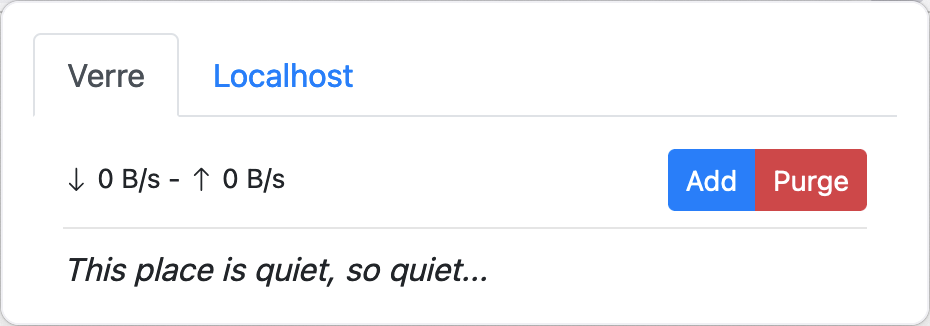
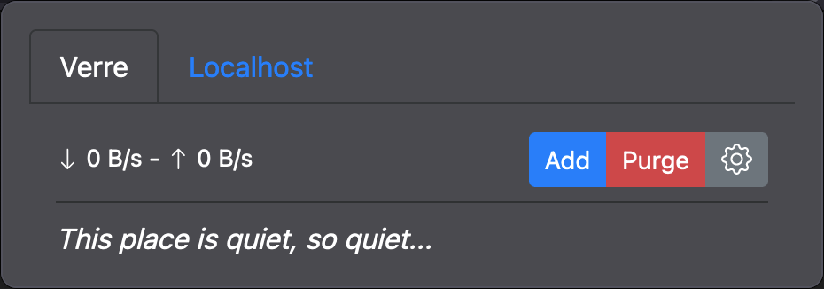
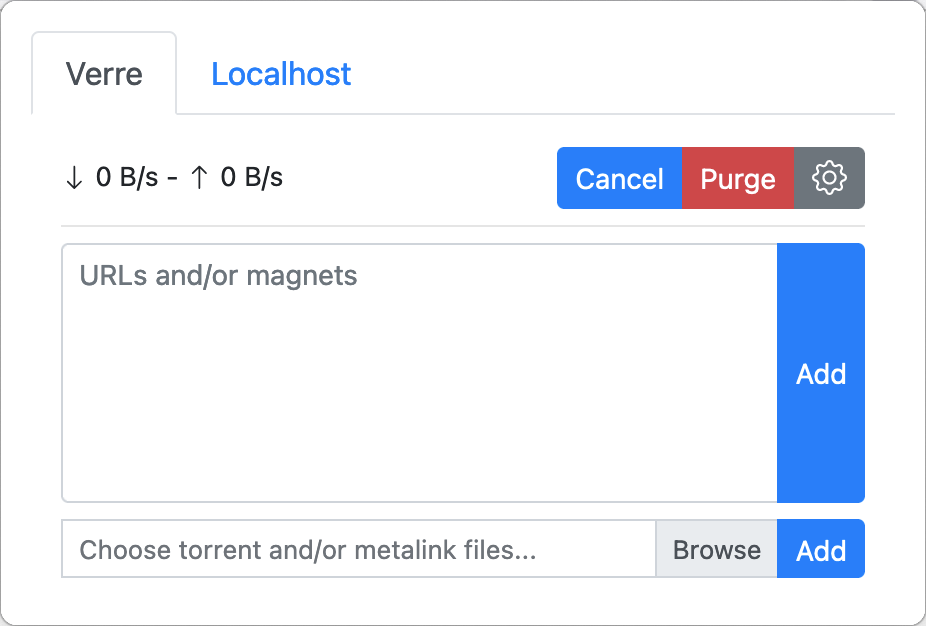
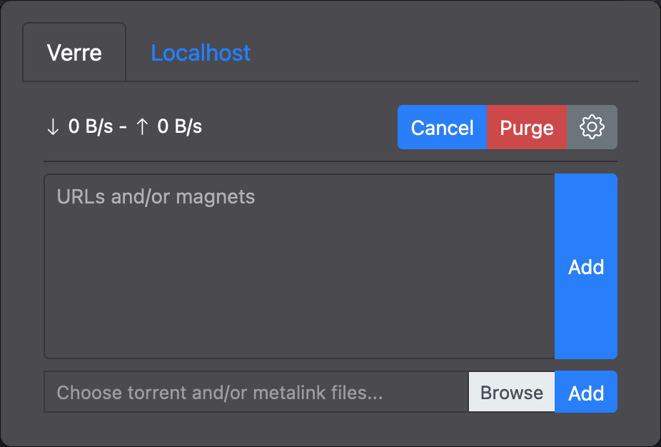
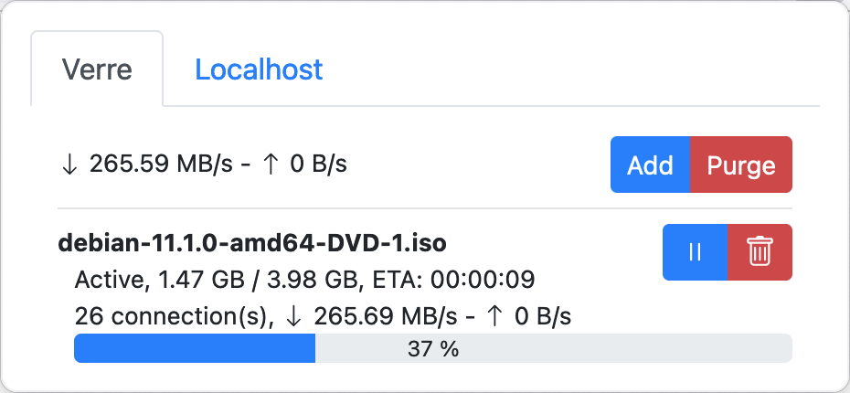
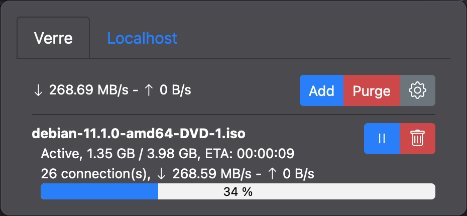
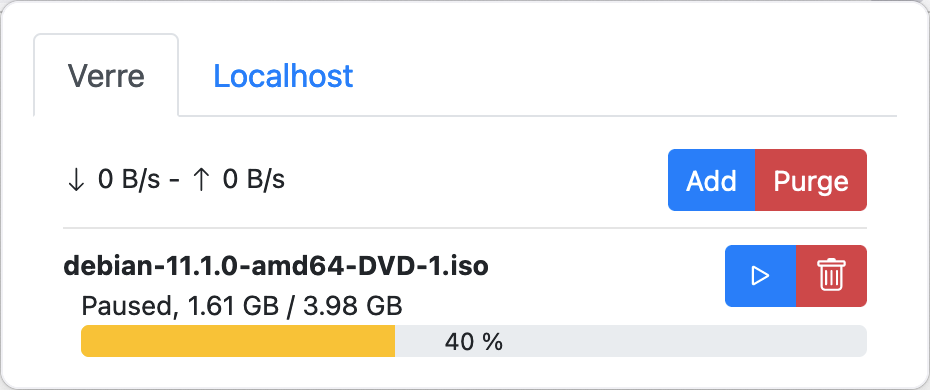
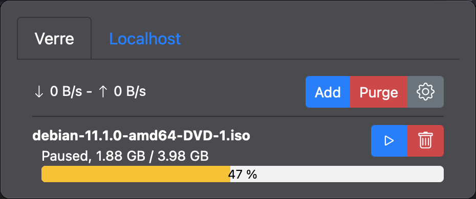
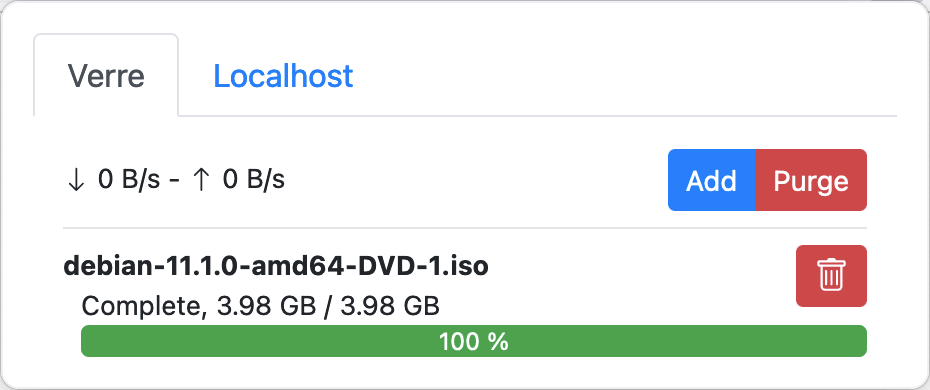
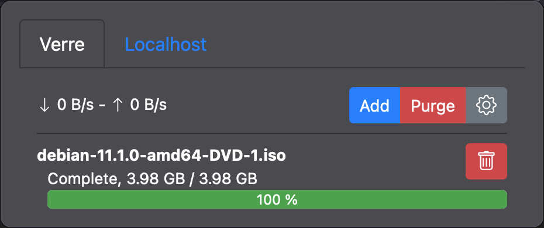

<h3 align="center">Aria2 Integration</h3>

    Aria2 Integration allows you to redirect downloads to your Aria2 server.

    
    

    
    

    
    

    
    

    
    

## Description

Aria2 Integration allows you to redirect downloads to your Aria2 server. This setting can be tuned in the extension's
preferences :

- You can enable/disable this functionality
- You can exclude some protocols, sites or/and file types

In addition, you can send download links via the context menus:

- Right click on a link and select your server in "Download with Aria2"
- Right click on multiple text links and select you server in "Download with Aria2"

By clicking on the extension icon, a popup appear. You can see the progress of each Aria2 server:

- Total download/upload speed
- Progress of each task and possibility to pause/resume/delete
- Delete all finished tasks
- Add links, torrent files, magnets link/files
- A quick settings to enable/disable download redirection

Finally, the extension is available in light/dark theme depending on your system preferences and you can add multiple servers in the extension's preferences.

## Quick start

- [Chrome Web Store](https://chrome.google.com/webstore/detail/aria2-integration/hnenidncmoeebipinjdfniagjnfjbapi)
- [Firefox Extension Store](https://addons.mozilla.org/en-US/firefox/addon/aria2-extension/)
