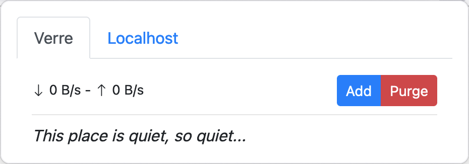
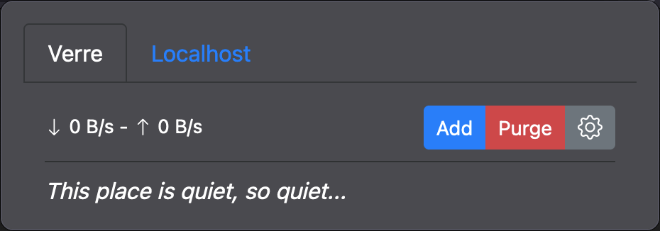
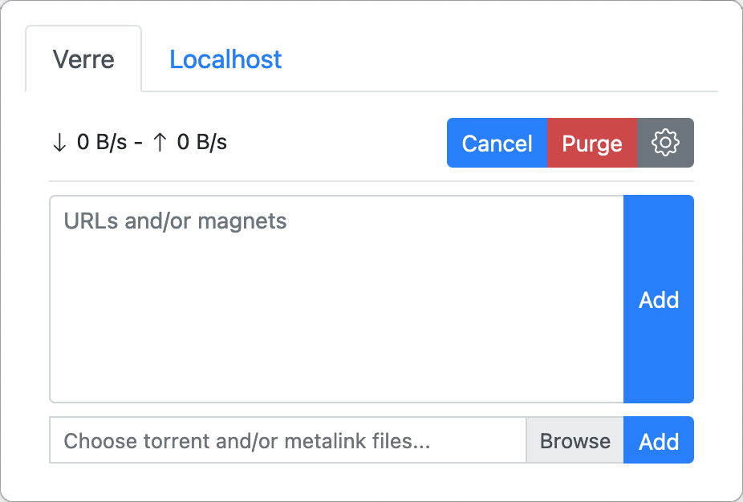
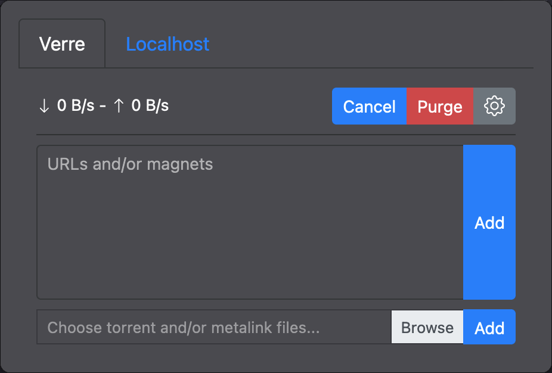
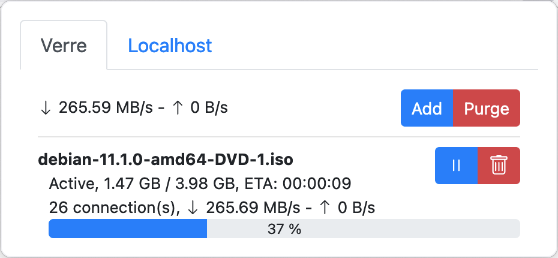
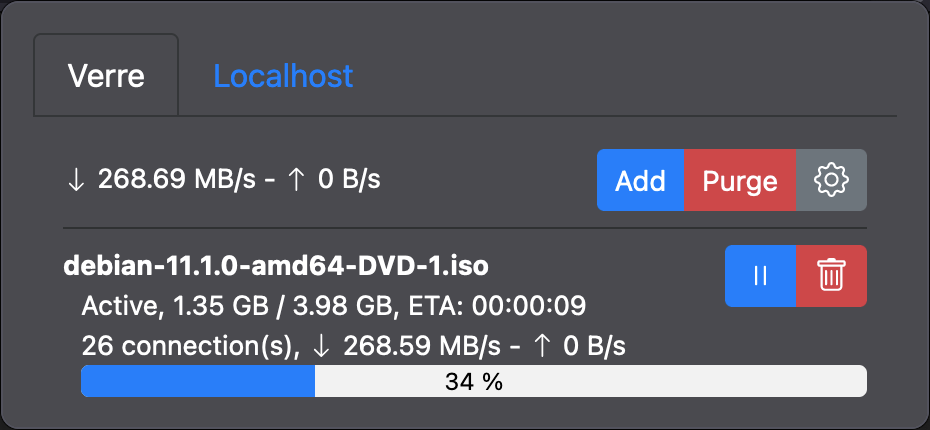
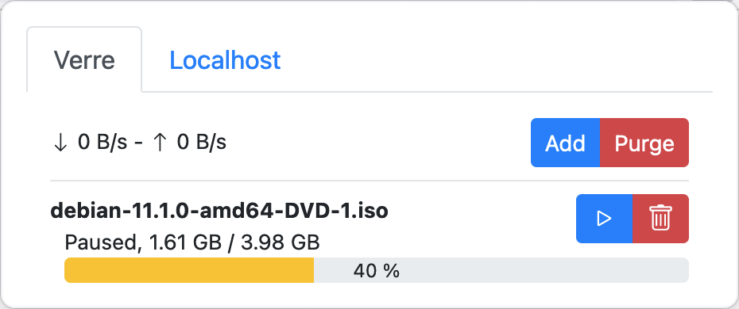
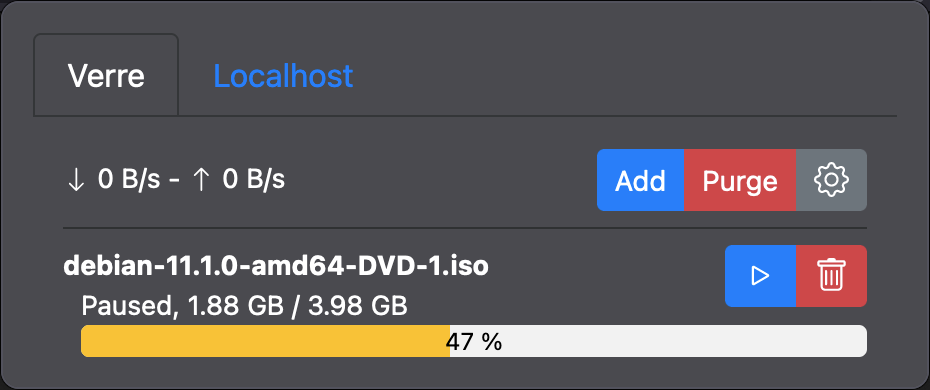
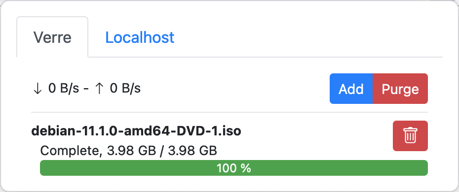
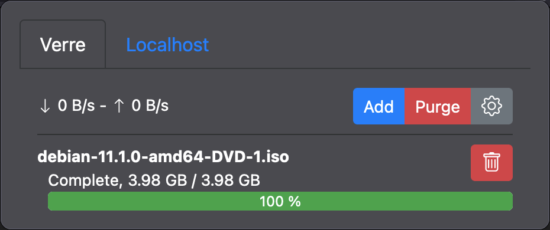

<h3 align="center">Aria2 Integration</h3>

    Send downloads, links, and torrent files directly to your Aria2 server.

    
    

    
    

    
    

    
    

    
    

## Description
Aria2 Integration makes it easy to send downloads from your browser straight to your Aria2 server.

Capture links, selected text, and browser downloads with a single click or from the extension popup. Manage multiple Aria2 servers, add URLs or torrent/metalink files manually, and keep everything under control from one simple interface.

### Key features
- Send links and selected text directly to Aria2
- Capture browser downloads and redirect them to your server
- Add torrent and metalink files from files or URLs
- Support for multiple Aria2 servers
- Quick access to active, waiting, paused, completed, and failed tasks
- Pause, resume, retry, or remove tasks from the popup
- Display download and upload speed, progress, ETA, and task status
- Customizable capture rules, including:
  - minimum file size
  - excluded protocols
  - excluded websites
  - excluded file types
- Option to preserve the full destination file path
- Notifications for added URLs, added files, and errors
- Light, dark, and automatic theme support

### Designed for flexibility
Whether you use Aria2 locally or on a remote server, Aria2 Integration helps you keep your downloads organized and accessible from your browser.

### Privacy
The extension does not collect any data.

## Quick start

- [Microsoft Edge Store](https://microsoftedge.microsoft.com/addons/detail/aria2-integration/hmmpdilndjfmceolhbgjejogjaglbiel) 
- [Chrome Web Store](https://chrome.google.com/webstore/detail/aria2-integration/hnenidncmoeebipinjdfniagjnfjbapi)
- [Firefox Extension Store](https://addons.mozilla.org/en-US/firefox/addon/aria2-extension/)
